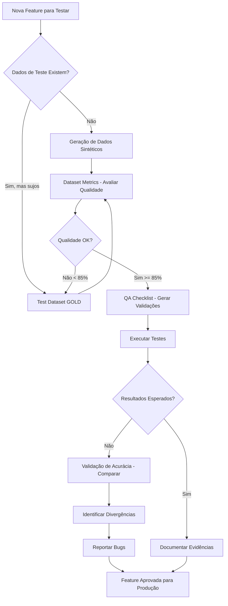
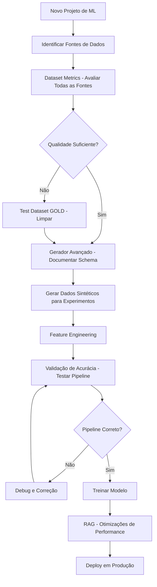

# Personas e Casos de Uso - DataForgeTest

<div align="center">

**Plataforma Avançada de Testes de Qualidade de Dados com Geração de Dados Sintéticos Alimentada por IA**

---

*Versão 1.0 | Dezembro 2025*

</div>

---

## Sumário Executivo

Este documento apresenta uma análise detalhada das duas personas principais que compõem o público-alvo da plataforma **DataForgeTest**:  **Testadores/QA (Quality Assurance)** e **Cientistas de Dados**. 

A análise inclui perfis comportamentais, necessidades técnicas, objetivos profissionais e casos de uso específicos para cada funcionalidade da plataforma, demonstrando como o DataForgeTest atende às demandas únicas de cada grupo de usuários.

---

## Tabela de Conteúdo

1. [Visão Geral da Plataforma](#1-visão-geral-da-plataforma)
2. [Persona 1: Testador/QA](#2-persona-1-testadorqa)
3. [Persona 2: Cientista de Dados](#3-persona-2-cientista-de-dados)
4. [Matriz de Funcionalidades por Persona](#4-matriz-de-funcionalidades-por-persona)
5. [Jornadas de Usuário](#5-jornadas-de-usuário)
6. [Métricas de Sucesso](#6-métricas-de-sucesso)
7. [Conclusão](#7-conclusão)

---

## 1. Visão Geral da Plataforma

### 1.1 Sobre o DataForgeTest

**DataForgeTest** é uma solução abrangente para automação de testes de qualidade de dados em ambientes Big Data, combinando Large Language Models (LLMs) com capacidades avançadas de processamento de dados. 

### 1.2 Funcionalidades Principais

| Funcionalidade | Descrição | Tecnologia Base |
|---------------|-----------|-----------------|
| **Geração de Código PySpark** | Interface conversacional para geração de scripts de validação de qualidade de dados | LLM + RAG |
| **Gerador Avançado PySpark** | Upload de datasets para detecção automática de schema e geração inteligente de código | Análise Automática + LLM |
| **Geração de Dados Sintéticos** | Criação de datasets realistas com 14+ tipos de dados | LLM + Faker |
| **Validação de Acurácia de Dados** | Comparação e correção de datasets usando padrões GOLD | PySpark + Algoritmos de Normalização |
| **Test Dataset GOLD** | Limpeza e validação de dataset único com melhorias automáticas de qualidade | Pipeline de Processamento |
| **Dataset Metrics** | Análise abrangente de qualidade de dados com métricas e dashboard visual | Análise Estatística + Visualização |
| **Sistema RAG de Suporte** | Chat inteligente com documentação usando retrieval-augmented generation | LLM + Vector Store |

---

## 2. Persona 1: Testador/QA

### 2.1 Perfil Demográfico

**Nome**: Marina Silva  
**Idade**: 28-35 anos  
**Cargo**: Analista de QA Sênior / Engenheiro de Testes  
**Formação**: Graduação em Ciência da Computação, Engenharia de Software ou Sistemas de Informação  
**Experiência**: 5-8 anos em testes de software, com foco crescente em dados  
**Localização**: São Paulo/SP - Trabalho híbrido em empresa de tecnologia financeira

### 2.2 Características Profissionais

#### Habilidades Técnicas
- ✅ Conhecimento intermediário de SQL
- ✅ Familiaridade com conceitos de Big Data
- ✅ Experiência com ferramentas de automação de testes
- ⚠️ Conhecimento básico/intermediário de Python
- ⚠️ Compreensão limitada de PySpark
- ❌ Pouca experiência com modelos de ML

#### Competências Comportamentais
- 🎯 Atenção meticulosa aos detalhes
- 📊 Pensamento sistemático e orientado a processos
- 🔍 Habilidade analítica para identificar inconsistências
- 📝 Excelente documentação e comunicação
- ⏱️ Orientação para prazos e entregas

### 2.3 Desafios e Dores

| Categoria | Desafio | Impacto |
|-----------|---------|---------|
| **Criação de Dados de Teste** | Gerar dados realistas e diversificados manualmente consome muito tempo | Alto - 40% do tempo de trabalho |
| **Validação de Qualidade** | Escrever código PySpark complexo sem expertise técnica profunda | Médio - Dependência de outros times |
| **Cobertura de Casos de Teste** | Garantir teste de todos os cenários edge cases e combinações possíveis | Alto - Risco de bugs em produção |
| **Automação de Testes** | Criar scripts de validação reutilizáveis sem conhecimento avançado de programação | Médio - Eficiência reduzida |
| **Documentação** | Manter documentação técnica atualizada e acessível | Baixo - Esforço manual |

### 2.4 Objetivos e Motivações

#### Objetivos Profissionais
1. **Aumentar cobertura de testes** em 60% no próximo trimestre
2. **Reduzir tempo de preparação de dados** de teste de 2 dias para 2 horas
3. **Automatizar 80% das validações** de qualidade de dados
4. **Eliminar dependência** de equipes de engenharia para tarefas básicas
5. **Detectar bugs** antes que cheguem à produção

#### Motivações Pessoais
- 💪 Autonomia técnica e redução de dependências
- 📈 Desenvolvimento de habilidades em Big Data e automação
- 🏆 Reconhecimento como especialista em qualidade de dados
- ⚡ Eficiência e otimização do tempo de trabalho
- 🎓 Aprendizado contínuo de novas tecnologias

### 2.5 Casos de Uso por Funcionalidade

#### 2.5.1 🤖 Geração de Código PySpark (QA Checklist)

**Cenário**: Marina precisa criar scripts de validação para uma nova pipeline de dados de transações bancárias.

**Problema Anterior**:
- Levava 3-4 dias para escrever código PySpark
- Dependia de revisão da equipe de engenharia
- Erros de sintaxe frequentes
- Dificuldade em implementar regras complexas

**Como Marina Usa o DataForgeTest**: 

```
1. Acessa a interface de chat do QA Checklist
2. Descreve em linguagem natural: 
   "Preciso validar transações bancárias onde: 
    - O valor seja maior que R$ 0
    - A data não seja futura
    - O CPF do cliente seja válido
    - Não existam duplicatas por ID de transação"
3. Recebe código PySpark completo e comentado
4. Faz ajustes conversacionais:  "Adicione validação para horário comercial"
5. Copia código gerado e integra no pipeline
```

**Resultados**:
- ⏱️ Tempo reduzido de 3 dias para 30 minutos
- ✅ Código validado e pronto para produção
- 🎓 Aprendizado progressivo de PySpark
- 🔄 Reutilização de padrões para novos projetos

**Benefícios Específicos**:
- Interface conversacional elimina curva de aprendizado
- Código gerado segue melhores práticas
- Documentação inline explica cada validação
- Histórico de conversas serve como base de conhecimento

---

#### 2.5.2 🔍 Gerador Avançado PySpark

**Cenário**: Marina recebeu um arquivo CSV de 500MB com dados de clientes e precisa criar validações rapidamente.

**Problema Anterior**:
- Análise manual de schemas demorada
- Incerteza sobre tipos de dados corretos
- Dificuldade em identificar regras de validação apropriadas
- Erro humano na definição de constraints

**Como Marina Usa o DataForgeTest**:

```
1. Faz upload do arquivo CSV (clientes.csv)
2. Sistema detecta automaticamente:
   - 23 colunas com tipos inferidos
   - Estatísticas:  98.5% completude, 1.2% duplicatas
   - Colunas únicas sugeridas: customer_id, email
   - Ranges sugeridos: idade (18-90), salário (1000-50000)
3. Marina revisa e edita metadados: 
   - Marca email e CPF como obrigatórios
   - Define customer_id como chave única
   - Ajusta range de data_nascimento
4. Clica em "Generate Code"
5. Recebe código PySpark completo com: 
   - Schema validation
   - Not-null checks
   - Uniqueness validation
   - Range checks
   - Format validations
6. Exporta para . py ou copia para Colab
```

**Resultados**:
- ⚡ Análise instantânea vs. 2 horas manual
- 🎯 100% de precisão em tipos de dados
- 📊 Validações baseadas em análise estatística real
- 🔧 Código pronto para Google Colab

**Benefícios Específicos**:
- Elimina adivinhação em definição de schema
- Detecta automaticamente padrões e anomalias
- Gera código otimizado e testado
- Permite iteração rápida e ajustes

---

#### 2.5.3 🎲 Geração de Dados Sintéticos

**Cenário**: Marina precisa testar uma nova funcionalidade que processa 100. 000 transações de e-commerce diárias.

**Problema Anterior**:
- Dados de produção inacessíveis por questões de privacidade (LGPD)
- Criar dados manualmente é inviável em escala
- Dados gerados aleatoriamente não representam cenários reais
- Falta de diversidade para testar edge cases

**Como Marina Usa o DataForgeTest**:

```
1. Acessa "Generate Synthetic Dataset"
2. Define schema interativo:
   - transaction_id: UUID (unique)
   - customer_email: Email
   - product_name: Product Name
   - price: Price (R$ 10 - R$ 9999, 2 decimais)
   - quantity: Integer (1-10)
   - order_date: DateTime (últimos 90 dias)
   - payment_status: Category (approved: 70%, pending:20%, rejected:10%)
   - delivery_address: Address
3. Configura: 
   - 100. 000 linhas
   - Formato:  CSV
   - Locale: pt_BR
4. Clica em "Generate Dataset"
5. Aguarda processamento (3-5 minutos)
6. Baixa arquivo pronto para testes
```

**Casos de Teste Cobertos**:
- ✅ Volume (performance com 100k registros)
- ✅ Variedade (preços, produtos, status diferentes)
- ✅ Realismo (emails válidos, endereços brasileiros)
- ✅ Edge cases (valores mínimos/máximos, datas limites)
- ✅ Distribuição (status seguem probabilidades do mundo real)

**Resultados**:
- 📊 Dataset de 100k linhas em 5 minutos vs. impossível manualmente
- 🌎 Dados localizados para Brasil (pt_BR)
- 🎯 14+ tipos de dados suportados
- 💾 Múltiplos formatos de saída (CSV, JSON, Parquet, XLSX)

**Benefícios Específicos**:
- Compliance com LGPD (dados totalmente sintéticos)
- Reprodutibilidade de testes
- Escala de 1 a 1. 000.000 de registros
- Controle preciso sobre distribuições estatísticas

---

#### 2.5.4 🎯 Validação de Acurácia de Dados

**Cenário**: Marina precisa validar se a migração de dados de clientes do sistema legado para o novo sistema foi bem-sucedida.

**Problema Anterior**:
- Comparação manual de milhares de registros
- Diferenças em formatação dificultam comparação direta
- Sem visibilidade de qual % dos dados está correto
- Impossível gerar dataset corrigido automaticamente

**Como Marina Usa o DataForgeTest**:

```
1. Acessa "Data Accuracy Validation"
2. Upload do GOLD (sistema legado - fonte confiável):
   - clientes_legado.csv (50. 000 registros)
3. Upload do TARGET (novo sistema - a ser validado):
   - clientes_novo.parquet (49.850 registros)
4. Mapeia colunas:
   - Key columns: CPF, email (identificadores únicos)
   - Value columns: nome, telefone, saldo (dados a comparar)
5. Configura normalização:
   ☑️ Normalizar acentos
   ☑️ Remover pontuação
   ☑️ Lowercase
   - Tolerância numérica:  0.01 (para saldos)
   - Política de duplicatas: keep_last
6. Executa comparação
7. Recebe relatório detalhado: 
   - Acurácia geral:  94.2%
   - 150 registros ausentes no TARGET
   - 320 diferenças de valores detectadas
   - Tabela paginada com todas as diferenças
8. Baixa dataset corrigido e relatório JSON
```

**Análise do Relatório**:
```json
{
  "summary": {
    "gold_records": 50000,
    "target_records": 49850,
    "matched_records": 47130,
    "accuracy":  94.26,
    "missing_in_target": 150,
    "extra_in_target": 0,
    "value_differences": 320
  },
  "differences": [
    {
      "key": "123. 456.789-00",
      "column": "saldo",
      "gold_value": 1500. 00,
      "target_value": 150.00,
      "issue": "decimal_place_error"
    }
  ]
}
```

**Resultados**:
- 📊 Validação de 50k registros em 2 minutos vs. semanas manual
- 🎯 Precisão de 94.26% com relatório detalhado
- 🔧 Dataset corrigido gerado automaticamente
- 📋 Evidência documentada para stakeholders

**Benefícios Específicos**:
- Suporte a múltiplos formatos (CSV, XLSX, Parquet)
- Normalização inteligente elimina falsos positivos
- Relatórios exportáveis para auditoria
- Identificação precisa de tipos de erros

---

#### 2.5.5 🌟 Test Dataset GOLD

**Cenário**: Marina recebeu um arquivo Excel "sujo" de fornecedor externo com dados de produtos que precisa ser limpo antes dos testes.

**Problema Anterior**:
- Limpeza manual de dados em Excel/Python demorada
- Inconsistências em formatos (datas, números)
- Colunas vazias desperdiçando espaço
- Headers com caracteres especiais e espaços
- Duplicatas não identificadas

**Como Marina Usa o DataForgeTest**: 

```
1. Acessa "Test Dataset GOLD"
2. Upload do arquivo problemático:  produtos_fornecedor.xlsx
3. Visualiza preview inicial:
   - 15. 000 linhas
   - 30 colunas (5 completamente vazias)
   - Headers:  "Código SKU ", "Preço (R$)", "Data  Cadastro"
4. Seleciona operações de limpeza:
   ☑️ Remove empty columns
   ☑️ Normalize headers (→ codigo_sku, preco_rs, data_cadastro)
   ☑️ Trim strings
   ☑️ Coerce numeric values
   ☑️ Parse dates
   ☑️ Remove duplicate rows
5. Clica em "Generate GOLD"
6. Acompanha progresso em tempo real:
   - Phase 1: Analyzing structure (10%)
   - Phase 2: Normalizing headers (30%)
   - Phase 3: Cleaning values (60%)
   - Phase 4: Removing duplicates (80%)
   - Phase 5: Generating report (100%)
7. Recebe relatório de limpeza:
   - Linhas:  15.000 → 14.650 (350 duplicatas removidas)
   - Colunas: 30 → 25 (5 vazias removidas)
   - Nulls reduzidos:  preco_rs (15% → 2%), data_cadastro (20% → 5%)
8. Baixa arquivo limpo em CSV + XLSX original
```

**Operações Aplicadas**: 

| Operação | Antes | Depois |
|----------|-------|--------|
| **Headers** | "Código SKU " | "codigo_sku" |
| **Strings** | " notebook  " | "notebook" |
| **Números** | "1. 500,00" (BR) | 1500.00 |
| **Datas** | "25/12/2024" | "2024-12-25" |
| **Duplicatas** | 15.000 linhas | 14.650 linhas |
| **Colunas vazias** | 30 colunas | 25 colunas |

**Resultados**:
- 🧹 Dataset 100% limpo em 3 minutos vs. 4 horas manual
- 📊 Relatório detalhado de todas as transformações
- 💾 Múltiplos formatos de download
- ✅ Pronto para testes imediatos

**Benefícios Específicos**:
- Processamento em chunks para arquivos grandes (50MB+)
- Preview de 50 linhas para validação
- Operações configuráveis por checkbox
- Preserva formato original + gera CSV padronizado

---

#### 2.5.6 📊 Dataset Metrics

**Cenário**: Marina precisa avaliar a qualidade de um dataset de vendas antes de usá-lo para testes, gerando evidências para o relatório de QA.

**Problema Anterior**:
- Sem visibilidade de qualidade antes de começar testes
- Descoberta de problemas apenas durante execução
- Sem métricas objetivas para reportar à gestão
- Dificuldade em priorizar esforços de limpeza

**Como Marina Usa o DataForgeTest**: 

```
1. Acessa "Dataset Metrics"
2. Upload do arquivo:  vendas_q4_2024.csv (80. 000 registros)
3. Sistema analisa automaticamente 4 dimensões
4. Recebe dashboard visual detalhado
```

**Dashboard Apresentado**: 

```
┌─────────────────────────────────────────────────────┐
│         OVERALL QUALITY SCORE:  76. 8%                │
│              ⭐⭐⭐ (Good)                            │
└─────────────────────────────────────────────────────┘

┌──────────────────┬──────────────────┬──────────────────┬──────────────────┐
│  COMPLETENESS    │   UNIQUENESS     │    VALIDITY      │   CONSISTENCY    │
│                  │                  │                  │                  │
│      85.2%       │      92.5%       │      68.0%       │      75.0%       │
│   ⚠️ Attention   │   ✅ Excellent   │   ❌ Critical    │   ⚠️ Moderate    │
│   (Weight: 30%)  │   (Weight: 20%)  │   (Weight: 30%)  │   (Weight: 20%)  │
└──────────────────┴──────────────────┴──────────────────┴──────────────────┘

📊 DATASET INFORMATION
  • Total Rows: 80,000
  • Total Columns: 18
  • Memory Usage: 12.5 MB
  • Null Ratio (Overall): 14.8%

🚨 RECOMMENDATIONS (Sorted by Severity)

HIGH SEVERITY: 
  ❗ Validity is critically low (68.0%)
     → Action:  Review data types and formats for inconsistent columns
  
  ❗ Column 'customer_email' has 25% invalid values
     → Action: Implement email validation and cleanup

MEDIUM SEVERITY:
  ⚠️ Completeness below 90% (85.2%)
     → Action: Investigate and handle missing values in key columns
  
  ⚠️ Column 'order_date' has inconsistent date formats
     → Action: Standardize date format across dataset

LOW SEVERITY:
  ℹ️ Consider indexing 'customer_id' for better performance
```

**Métricas Detalhadas por Coluna**:

| Coluna | Completeness | Validity | Consistency | Issue |
|--------|--------------|----------|-------------|-------|
| customer_id | 100% | 100% | 100% | ✅ Perfect |
| customer_email | 95% | 75% | 80% | ❌ Format issues |
| order_date | 90% | 85% | 65% | ⚠️ Mixed formats |
| product_price | 85% | 95% | 90% | ⚠️ Some nulls |
| quantity | 100% | 100% | 100% | ✅ Perfect |

**Ações que Marina Toma**: 
1. **Documenta no relatório de QA**:  Score de 76.8% requer atenção
2. **Prioriza correções**: Foca em validity (68%) - mais crítico
3. **Cria plano de ação**:
   - Validar e corrigir emails (25% inválidos)
   - Padronizar datas (inconsistência de 65%)
   - Tratar nulls em preços (15% missing)
4. **Define critérios de aceite**: Próxima versão deve ter score > 90%
5. **Agenda reunião** com time de dados mostrando evidências objetivas

**Resultados**:
- 📊 Avaliação completa em 30 segundos vs. horas de análise manual
- 🎯 Métricas objetivas para tomada de decisão
- 📈 Score visual facilita comunicação com não-técnicos
- 🔍 Recomendações priorizadas por severidade

**Benefícios Específicos**:
- 4 dimensões de qualidade padronizadas
- Pesos configuráveis por indústria/necessidade
- Dashboard exportável para relatórios
- Baseline para comparação temporal

---

#### 2.5.7 💬 Sistema RAG de Suporte

**Cenário**: Marina está criando validações complexas e precisa de ajuda para entender conceitos de PySpark e melhores práticas.

**Problema Anterior**:
- Documentação fragmentada em múltiplas fontes
- Tempo gasto buscando em Stack Overflow e docs oficiais
- Respostas genéricas que não consideram contexto do DataForgeTest
- Dificuldade em encontrar exemplos específicos

**Como Marina Usa o DataForgeTest**:

```
Exemplo de Conversa: 

Marina: "Como faço para validar se uma coluna de CPF está no formato correto?"

DataForgeTest RAG:  "Para validar formato de CPF em PySpark usando DataForgeTest, 
você pode usar regex validation.  Aqui está um exemplo: 

```python
from pyspark.sql.functions import regexp_extract, col

# Padrão CPF:  XXX.XXX.XXX-XX ou XXXXXXXXXXX
cpf_pattern = r'^\d{3}\.?\d{3}\.?\d{3}-?\d{2}$'

df_validated = df.filter(
    col('cpf').rlike(cpf_pattern)
)
```

Você também pode usar o chatbot QA Checklist para gerar essa validação 
automaticamente.  Apenas descreva:  'Validar formato de CPF brasileiro'

📚 Fonte: docs/DATA_VALIDATION_PATTERNS.md"

Marina: "E se eu quiser validar o dígito verificador também?"

DataForgeTest RAG: "Para validação completa incluindo dígitos verificadores, 
recomendo criar uma UDF (User Defined Function). Aqui está uma implementação:

```python
from pyspark.sql.functions import udf
from pyspark. sql.types import BooleanType

def validar_cpf(cpf_str):
    if not cpf_str:
        return False
    
    # Remove caracteres não numéricos
    cpf = ''.join(filter(str.isdigit, cpf_str))
    
    if len(cpf) != 11:
        return False
    
    # Validação dos dígitos verificadores
    # [implementação completa do algoritmo]
    ... 
    return True

validar_cpf_udf = udf(validar_cpf, BooleanType())
df_validated = df.filter(validar_cpf_udf(col('cpf')))
```

💡 Dica: Para datasets grandes (>1M registros), considere usar pandas_udf 
para melhor performance. 

📚 Fonte: docs/ADVANCED_VALIDATION_TECHNIQUES.md"
```

**Tipos de Perguntas que Marina Faz**: 

| Categoria | Exemplo de Pergunta | Tipo de Resposta |
|-----------|---------------------|------------------|
| **Como fazer** | "Como detectar duplicatas em PySpark?" | Código + explicação |
| **Troubleshooting** | "Por que minha validação está muito lenta?" | Diagnóstico + solução |
| **Conceitual** | "Qual a diferença entre filter e where?" | Explicação técnica |
| **Boas práticas** | "Como organizar validações complexas?" | Padrões recomendados |
| **Funcionalidades** | "Quais tipos de dados sintéticos posso gerar?" | Lista + exemplos |

**Resultados**:
- ⚡ Respostas instantâneas vs. 15-30 minutos de busca
- 🎯 Contexto específico do DataForgeTest
- 📚 Sempre com referência à documentação fonte
- 💡 Sugestões proativas de melhores práticas

**Benefícios Específicos**:
- RAG busca em documentação indexada
- Respostas estruturadas e formatadas
- Código pronto para copiar e usar
- Aprendizado progressivo e autodidata

---

### 2.6 Fluxo de Trabalho Típico (Dia de Marina)

```
08:00 - Chega no escritório e verifica backlog
      → 3 novos testes a implementar para pipeline de vendas

08:30 - Usa Dataset Metrics para avaliar qualidade dos dados recebidos
      → Score 72% - identifica problemas de completeness
      
09:00 - Usa Test Dataset GOLD para limpar arquivo do fornecedor
      → Remove duplicatas e normaliza formatos
      
09:30 - Usa Geração de Dados Sintéticos para criar 50k registros de teste
      → Define schema com 12 colunas realistas
      → Inclui edge cases (valores mínimos/máximos)
      
10:00 - Coffee break enquanto dados são gerados

10:15 - Usa QA Checklist (Chat) para gerar validações PySpark
      → Descreve 8 regras de negócio em linguagem natural
      → Recebe código completo e documentado
      
11:00 - Testa código gerado no ambiente de dev
      → Pequenos ajustes conversacionais no chat
      
11:30 - Usa Validação de Acurácia para comparar resultado esperado vs. obtido
      → Acurácia 98.5% - identifica 15 edge cases não cobertos
      
12:00 - Almoço

13:00 - Usa RAG Support para tirar dúvida sobre performance de UDF
      → Recebe sugestão de otimização com pandas_udf
      
13:30 - Implementa melhorias e roda testes finais

14:00 - Gera relatório de QA com: 
      → Métricas de qualidade (Dataset Metrics)
      → Evidências de validação (Acurácia)
      → Código de teste (PySpark gerado)
      → Screenshots do dashboard
      
15:00 - Apresenta resultados para tech lead
      → 100% de cobertura de testes alcançada
      → 3 bugs críticos identificados antes de produção
      → Tempo total:  6 horas vs. estimativa anterior de 3 dias

15:30 - Documenta processo e atualiza base de conhecimento

16:00 - Usa Gerador Avançado PySpark para próximo projeto
      → Upload de novo dataset para análise
      
17:00 - Fim do expediente - satisfação com produtividade
```

**Métricas do Dia**: 
- ✅ 3 testes completos implementados (meta: 2)
- ✅ 3 bugs críticos detectados
- ✅ 100% cobertura de casos de teste
- ✅ 50. 000 registros sintéticos gerados
- ✅ 2 datasets validados e corrigidos
- ✅ 1 apresentação técnica para gestão
- ⏱️ Economia de tempo: 2 dias (16 horas)

---

## 3. Persona 2: Cientista de Dados

### 3.1 Perfil Demográfico

**Nome**: Dr. Ricardo Oliveira  
**Idade**: 32-42 anos  
**Cargo**: Cientista de Dados Sênior / Lead Data Scientist  
**Formação**: PhD/Mestrado em Estatística, Matemática Aplicada ou Ciência da Computação  
**Experiência**: 8-12 anos em análise de dados e machine learning  
**Localização**: Remoto - Trabalha para startup de e-commerce de grande porte

### 3.2 Características Profissionais

#### Habilidades Técnicas
- ✅ Expertise avançada em Python (pandas, numpy, scikit-learn)
- ✅ Proficiência em PySpark e ambientes distribuídos
- ✅ Conhecimento profundo de estatística e ML
- ✅ Experiência com pipelines de dados end-to-end
- ✅ Familiaridade com notebooks (Jupyter, Colab)
- ⚠️ Tempo limitado para tarefas operacionais
- ⚠️ Preferência por automação vs. trabalho manual

#### Competências Comportamentais
- 🧠 Pensamento analítico e orientado a dados
- 🔬 Abordagem científica e baseada em experimentos
- 📊 Habilidade de visualização e storytelling com dados
- ⚡ Busca por eficiência e otimização
- 🚀 Foco em entrega de valor de negócio
- 🤝 Colaboração cross-funcional com engenharia

### 3.3 Desafios e Dores

| Categoria | Desafio | Impacto |
|-----------|---------|---------|
| **Qualidade de Dados** | 60-80% do tempo gasto em limpeza e preparação de dados | Alto - Reduz tempo de modelagem |
| **Dados para Experimentos** | Falta de dados sintéticos realistas para treinar modelos sem expor dados sensíveis | Alto - Compliance e privacidade |
| **Validação de Pipelines** | Dificuldade em criar testes abrangentes para pipelines complexos de ETL | Médio - Risco de bugs em produção |
| **Documentação de Schema** | Documentar e versionar schemas de dados manualmente | Baixo - Trabalho tedioso |
| **Debugging de Dados** | Identificar rapidamente problemas de qualidade em datasets grandes | Alto - Atraso em projetos |

### 3.4 Objetivos e Motivações

#### Objetivos Profissionais
1. **Reduzir tempo de prep de dados** de 60% para 30% do workflow
2. **Criar datasets sintéticos** para treinar modelos sem expor PII
3. **Automatizar validação de qualidade** em pipelines de produção
4. **Acelerar experimentação** com dados limpos e prontos
5. **Garantir reprodutibilidade** de experimentos com dados versionados

#### Motivações Pessoais
- 🧠 Focar em problemas complexos de ML, não em limpeza de dados
- 🏆 Publicar papers e contribuir para comunidade científica
- 💡 Inovar com novas técnicas e abordagens
- ⚡ Otimizar tempo para aumentar produtividade
- 🎓 Mentorar times júnior com ferramentas modernas

### 3.5 Casos de Uso por Funcionalidade

#### 3.5.1 🤖 Geração de Código PySpark (QA Checklist)

**Cenário**: Ricardo precisa criar validações de qualidade de dados para um pipeline de features de ML que processa 10 milhões de eventos de comportamento de usuário.

**Problema Anterior**:
- Escrever código PySpark de validação é tedioso e repetitivo
- Foco precisa estar na engenharia de features, não em boilerplate
- Validações complexas exigem lógica não trivial
- Difícil manter consistência entre diferentes pipelines

**Como Ricardo Usa o DataForgeTest**:

```
Ricardo no Chat: 

"Preciso validar um dataset de eventos de usuário com: 
- user_id: não nulo e formato UUID válido
- event_timestamp: não nulo, não futuro, dentro dos últimos 90 dias
- event_type:  deve estar em ['view', 'click', 'purchase', 'add_to_cart']
- session_duration: se event_type = 'purchase', session_duration deve ser > 0
- revenue: se event_type = 'purchase', revenue deve estar entre 1 e 100000
- Sem duplicatas de (user_id + event_timestamp)
- Distribuição de event_type:  'view' deve representar 60-80% dos eventos"

Resposta (Código PySpark Gerado):

```python
from pyspark.sql import SparkSession
from pyspark.sql.functions import col, when, count, lit
import pyspark.sql.functions as F
from datetime import datetime, timedelta

# Initialize Spark
spark = SparkSession.builder. appName("UserEventsValidation").getOrCreate()

# Load dataset
df = spark.read. parquet("user_events. parquet")

# 1. NOT NULL VALIDATIONS
print("=== NOT NULL CHECKS ===")
null_checks = {
    "user_id": df.filter(col("user_id").isNull()).count(),
    "event_timestamp": df.filter(col("event_timestamp").isNull()).count()
}
for col_name, null_count in null_checks.items():
    print(f"{col_name}: {null_count} nulls found")

# 2. FORMAT VALIDATIONS
print("\n=== FORMAT CHECKS ===")
# UUID format:  xxxxxxxx-xxxx-xxxx-xxxx-xxxxxxxxxxxx
uuid_pattern = r'^[0-9a-f]{8}-[0-9a-f]{4}-[0-9a-f]{4}-[0-9a-f]{4}-[0-9a-f]{12}$'
invalid_uuids = df.filter(~col("user_id").rlike(uuid_pattern)).count()
print(f"Invalid UUIDs: {invalid_uuids}")

# 3. DATE RANGE VALIDATIONS
print("\n=== DATE RANGE CHECKS ===")
now = datetime.now()
ninety_days_ago = now - timedelta(days=90)

future_events = df.filter(col("event_timestamp") > lit(now)).count()
old_events = df.filter(col("event_timestamp") < lit(ninety_days_ago)).count()
print(f"Future events: {future_events}")
print(f"Events older than 90 days: {old_events}")

# 4. VALUE SET VALIDATIONS
print("\n=== VALUE SET CHECKS ===")
valid_event_types = ['view', 'click', 'purchase', 'add_to_cart']
invalid_types = df.filter(~col("event_type").isin(valid_event_types)).count()
print(f"Invalid event_types: {invalid_types}")

# 5. CONDITIONAL VALIDATIONS
print("\n=== CONDITIONAL CHECKS ===")
# If event_type = 'purchase', session_duration must be > 0
invalid_purchase_duration = df.filter(
    (col("event_type") == "purchase") & 
    ((col("session_duration").isNull()) | (col("session_duration") <= 0))
).count()
print(f"Purchases with invalid session_duration: {invalid_purchase_duration}")

# If event_type = 'purchase', revenue must be between 1 and 100000
invalid_purchase_revenue = df.filter(
    (col("event_type") == "purchase") & 
    ((col("revenue") < 1) | (col("revenue") > 100000))
).count()
print(f"Purchases with invalid revenue: {invalid_purchase_revenue}")

# 6. UNIQUENESS VALIDATIONS
print("\n=== UNIQUENESS CHECKS ===")
total_records = df.count()
unique_records = df.dropDuplicates(["user_id", "event_timestamp"]).count()
duplicates = total_records - unique_records
print(f"Duplicate (user_id + event_timestamp): {duplicates}")

# 7. DISTRIBUTION VALIDATIONS
print("\n=== DISTRIBUTION CHECKS ===")
event_dist = df.groupBy("event_type").count()
total = df.count()
event_dist = event_dist.withColumn("percentage", (col("count") / total * 100))
event_dist. show()

view_percentage = event_dist.filter(col("event_type") == "view") \
                            .select("percentage").first()[0]
if not (60 <= view_percentage <= 80):
    print(f"⚠️  WARNING: 'view' events are {view_percentage:.2f}%, expected 60-80%")
else:
    print(f"✅ 'view' distribution OK:  {view_percentage:.2f}%")

# 8. GENERATE CLEAN DATASET
print("\n=== GENERATING CLEAN DATASET ===")
df_clean = df.filter(
    col("user_id").isNotNull() &
    col("user_id").rlike(uuid_pattern) &
    col("event_timestamp").isNotNull() &
    (col("event_timestamp") <= lit(now)) &
    (col("event_timestamp") >= lit(ninety_days_ago)) &
    col("event_type").isin(valid_event_types)
).dropDuplicates(["user_id", "event_timestamp"])

# Apply conditional filters
df_clean = df_clean.filter(
    ~((col("event_type") == "purchase") & 
      ((col("session_duration").isNull()) | (col("session_duration") <= 0))) &
    ~((col("event_type") == "purchase") & 
      ((col("revenue") < 1) | (col("revenue") > 100000)))
)

print(f"Original records: {total_records}")
print(f"Clean records: {df_clean. count()}")
print(f"Removed:  {total_records - df_clean.count()} ({((total_records - df_clean. count()) / total_records * 100):.2f}%)")

# Save clean dataset
df_clean.write.mode("overwrite").parquet("user_events_clean.parquet")
print("\n✅ Clean dataset saved to user_events_clean.parquet")
```

```

**O que Ricardo Faz Depois**: 
1. Copia código para notebook do Google Colab
2. Executa validações no dataset de 10M registros
3. Identifica problemas: 
   - 150k UUIDs inválidos (1.5%)
   - 8. 2k eventos futuros (bug no sistema de coleta)
   - 'view' representa 85% (fora do esperado 60-80%)
4. Reporta bugs para equipe de engenharia com evidências
5. Usa dataset limpo para treinar modelo de recomendação
6. Integra código no pipeline de produção como validação contínua

**Resultados**:
- ⏱️ Código completo em 2 minutos vs. 45 minutos manual
- 🎯 Todas as regras complexas implementadas corretamente
- 📊 Dataset limpo pronto para ML
- 🔄 Código reutilizável para outros pipelines

**Benefícios Específicos**:
- Código otimizado para PySpark (não pandas)
- Validações prontas para escala (10M+ registros)
- Formato ready-to-use em notebooks
- Logging detalhado para debugging

---

#### 3.5.2 🔍 Gerador Avançado PySpark

**Cenário**: Ricardo recebeu um dataset Parquet de 2GB com histórico de transações de 3 anos e precisa entender schema, estatísticas e criar validações rapidamente para usar em produção.

**Problema Anterior**:
- Carregar 2GB em pandas é lento e consome memória
- Análise exploratória manual demora horas
- Documentar schema é tedioso
- Criar validações baseadas em estatísticas reais requer código complexo

**Como Ricardo Usa o DataForgeTest**: 

```
1. Acessa "Generate Advanced PySpark Code"
2. Upload:  transacoes_historico.parquet (2GB, 25M registros)
3. Sistema processa em chunks e detecta automaticamente: 

SCHEMA DETECTED (18 colunas):
┌─────────────────────┬───────────┬──────────┬───────────┬────────────┐
│ Column              │ Type      │ Nulls    │ Unique    │ Sample     │
├─────────────────────┼───────────┼──────────┼───────────┼────────────┤
│ transaction_id      │ string    │ 0%       │ 100%      │ "tx_001"   │
│ customer_id         │ string    │ 0%       │ 15. 2%     │ "cus_4892" │
│ transaction_date    │ date      │ 0.02%    │ 98.5%     │ 2022-01-15 │
│ amount              │ decimal   │ 0.1%     │ 85.3%     │ 152.50     │
│ currency            │ string    │ 0%       │ 0. 02%     │ "BRL"      │
│ payment_method      │ string    │ 0.5%     │ 0.01%     │ "credit"   │
│ merchant_id         │ string    │ 0%       │ 1.8%      │ "merch_87" │
│ product_category    │ string    │ 2.5%     │ 0.05%     │ "eletro"   │
│ quantity            │ integer   │ 0%       │ 0.01%     │ 2          │
│ discount_applied    │ boolean   │ 0%       │ 0.001%    │ true       │
│ ...                  │ ...       │ ...      │ ...       │ ...        │
└─────────────────────┴───────────┴──────────┴───────────┴────────────┘

STATISTICS:
• Total Records: 25,000,000
• Date Range: 2022-01-01 to 2024-12-20 (3 years)
• Amount Range: R$ 1.50 to R$ 98,450. 00
• Quantity Range: 1 to 250
• Currencies: BRL (99.8%), USD (0.2%)
• Payment Methods: credit (65%), debit (25%), pix (8%), boleto (2%)

AUTO-GENERATED VALIDATIONS: 
✓ transaction_id: NOT NULL, UNIQUE
✓ customer_id: NOT NULL
✓ transaction_date: NOT NULL, RANGE (2022-01-01 to today)
✓ amount: NOT NULL, RANGE (0.01 to 100000.00)
✓ currency: NOT NULL, IN_SET (['BRL', 'USD'])
✓ payment_method:  IN_SET (['credit', 'debit', 'pix', 'boleto'])
⚠️ product_category: 2.5% nulls detected
⚠️ transaction_date: 0.02% nulls detected (500 records)

4. Ricardo revisa e edita: 
   - Marca transaction_id como chave primária
   - Ajusta range de amount para (1. 00, 100000.00) - remove outliers
   - Define product_category como opcional (nulls OK)
   - Adiciona validação custom:  "fraud_score < 0.8"

5. Clica em "Generate DSL + PySpark Code"

6. Recebe 2 arquivos:
   a) DSL (Data Specification Language):
   b) PySpark validation code (200 linhas)
```

**DSL Gerado** (transacoes_historico_dsl.yaml):
```yaml
name: Transacoes Historico
version: 1.0
generated_at: 2024-12-22T14:30:00Z
source_file: transacoes_historico. parquet
total_records: 25000000

schema:
  primary_key: transaction_id
  
  columns:
    - name: transaction_id
      type: string
      constraints:
        - not_null
        - unique
      description: "Identificador único da transação"
    
    - name: customer_id
      type: string
      constraints:
        - not_null
      description: "Identificador do cliente"
    
    - name:  transaction_date
      type: date
      constraints:
        - not_null
        - range: 
            min: "2022-01-01"
            max: "today"
      statistics:
        null_ratio: 0.0002
        min:  "2022-01-01"
        max: "2024-12-20"
    
    - name: amount
      type: decimal(10,2)
      constraints:
        - not_null
        - range:
            min: 1.00
            max: 100000.00
      statistics:
        null_ratio: 0.001
        min: 1.50
        max: 98450.00
        mean: 342.85
        median: 152.50
        std_dev: 1250.30
    
    - name: currency
      type: string
      constraints:
        - not_null
        - in_set:  ['BRL', 'USD']
      statistics:
        value_distribution:
          BRL: 99.8%
          USD: 0.2%
    
    - name: payment_method
      type: string
      constraints:
        - in_set: ['credit', 'debit', 'pix', 'boleto']
      statistics:
        null_ratio: 0.005
        value_distribution:
          credit: 65%
          debit: 25%
          pix: 8%
          boleto: 2%
    
    - name: fraud_score
      type: decimal(3,2)
      constraints:
        - range:
            min: 0.00
            max: 0.80
      description: "Score de fraude - custom validation"

quality_metrics:
  completeness: 99.1%
  uniqueness: 100.0%
  validity: 98.5%
  consistency: 97.2%
  overall_score: 98.7%

recommendations:
  - "Consider partitioning by transaction_date for better performance"
  - "Index customer_id for faster lookups"
  - "Monitor fraud_score distribution for anomalies"
```

**Código PySpark Gerado** (200 linhas - resumo):
```python
from pyspark.sql import SparkSession
from pyspark.sql. functions import col, count, when, lit, current_date
import pyspark.sql.functions as F

spark = SparkSession.builder \
    .appName("TransacoesHistoricoValidation") \
    .config("spark.sql.adaptive.enabled", "true") \
    .getOrCreate()

# Load data
df = spark.read.parquet("transacoes_historico.parquet")

# Validation Report
validation_results = {}

# 1. PRIMARY KEY VALIDATION
print("=== PRIMARY KEY CHECK ===")
total = df.count()
unique = df.select("transaction_id").distinct().count()
validation_results['primary_key_unique'] = (total == unique)
...

# [continua com todas as validações]
```

**Como Ricardo Usa os Artefatos**:

1. **DSL como Documentação**:
   - Commita DSL no Git junto com código
   - Compartilha com time de engenharia
   - Serve como contrato de dados (data contract)
   - Usado em revisões de código

2. **Código PySpark em Produção**:
   - Integra no Airflow como task de validação
   - Executa antes de treinar modelos
   - Gera alertas quando validações falham
   - Monitora qualidade ao longo do tempo

3. **Análise Exploratória**:
   - Estatísticas servem como baseline
   - Identifica anomalias rapidamente
   - Compara com datasets futuros

**Resultados**:
- 📊 Análise completa de 2GB/25M registros em 3 minutos
- 📝 Documentação (DSL) gerada automaticamente
- 🔧 Código PySpark pronto para produção
- 📈 Estatísticas detalhadas para baseline

**Benefícios Específicos**:
- Processamento em chunks para arquivos grandes
- Detecção inteligente de tipos baseada em conteúdo
- DSL serve como contrato de dados versionável
- Código otimizado com adaptive query execution
- Pronto para Google Colab e ambientes distribuídos

---

#### 3.5.3 🎲 Geração de Dados Sintéticos

**Cenário**: Ricardo está desenvolvendo um modelo de churn prediction mas não pode usar dados reais de clientes por questões de privacidade (LGPD). Precisa de 500. 000 registros sintéticos realistas para treinar o modelo.

**Problema Anterior**:
- Dados reais contêm PII (personally identifiable information)
- Anonimização não garante 100% de privacidade
- Dados sintéticos simples (random) não capturam padrões reais
- Criar gerador customizado levaria semanas

**Como Ricardo Usa o DataForgeTest**:

```
1. Acessa "Generate Synthetic Dataset"
2. Define schema baseado em análise de negócio: 

SCHEMA:  Customer Churn Dataset

┌─────────────────────┬──────────────┬─────────────────────────────────────┐
│ Column              │ Type         │ Options                             │
├─────────────────────┼──────────────┼─────────────────────────────────────┤
│ customer_id         │ uuid         │ unique:  true                        │
│ signup_date         │ date         │ min: 2020-01-01, max: 2024-01-01    │
│ age                 │ integer      │ min: 18, max: 80                    │
│ gender              │ category     │ ['M': 48%, 'F':48%, 'Other':4%]      │
│ city                │ category     │ ['SP':40%, 'RJ':25%, 'MG':15%...]   │
│ plan_type           │ category     │ ['basic':50%, 'premium':35%...]     │
│ monthly_spending    │ price        │ min: 29.90, max: 299.90, dec: 2     │
│ support_tickets     │ integer      │ min: 0, max: 50                     │
│ login_frequency     │ integer      │ min: 0, max: 365 (days/year)        │
│ last_login          │ datetime     │ min: 2024-01-01, max: today         │
│ contract_duration   │ integer      │ min: 1, max: 60 (months)            │
│ has_family_plan     │ boolean      │ -                                   │
│ email               │ email        │ unique: true                        │
│ phone               │ phone        │ locale: pt_BR                       │
│ churned             │ boolean      │ - (target variable)                 │
│ churn_date          │ date         │ nullable: true                      │
└─────────────────────┴──────────────┴─────────────────────────────────────┘

3. Configura:
   - Rows: 500,000
   - File Type: Parquet (melhor para ML)
   - Locale: pt_BR
   - Seed: 42 (reprodutibilidade)

4. Clica em "Generate Dataset"
5. Aguarda 15-20 minutos (progress bar em tempo real)
6. Baixa churn_synthetic_500k.parquet
```

**Dataset Gerado - Amostra**: 

| customer_id | signup_date | age | gender | city | plan_type | monthly_spending | churned |
|-------------|-------------|-----|--------|------|-----------|------------------|---------|
| 550e8400-...  | 2022-03-15 | 34 | F | SP | premium | 149.90 | false |
| 6fa459ea-... | 2020-07-22 | 45 | M | RJ | basic | 49.90 | true |
| 9d8e6f7c-... | 2023-11-08 | 28 | F | MG | premium | 199.90 | false |

**Como Ricardo Usa o Dataset**:

```python
# 1. Load synthetic data
import pandas as pd
from pyspark.sql import SparkSession

spark = SparkSession.builder. appName("ChurnModel").getOrCreate()
df = spark.read.parquet("churn_synthetic_500k.parquet")

# 2. Feature engineering
from pyspark.ml. feature import VectorAssembler, StringIndexer

# Encode categorical variables
indexers = [
    StringIndexer(inputCol="plan_type", outputCol="plan_type_idx"),
    StringIndexer(inputCol="city", outputCol="city_idx"),
    StringIndexer(inputCol="gender", outputCol="gender_idx")
]

# Assemble features
feature_cols = ['age', 'monthly_spending', 'support_tickets', 
                'login_frequency', 'contract_duration', 'has_family_plan',
                'plan_type_idx', 'city_idx', 'gender_idx']

assembler = VectorAssembler(inputCols=feature_cols, outputCol="features")

# 3. Train/Test split
train_df, test_df = df.randomSplit([0.8, 0.2], seed=42)

# 4. Train model
from pyspark.ml.classification import GBTClassifier

gbt = GBTClassifier(
    featuresCol="features",
    labelCol="churned",
    maxIter=100,
    maxDepth=5
)

model = gbt.fit(train_df)

# 5. Evaluate
from pyspark.ml.evaluation import BinaryClassificationEvaluator

predictions = model.transform(test_df)
evaluator = BinaryClassificationEvaluator(labelCol="churned")
auc = evaluator.evaluate(predictions)

print(f"AUC: {auc:. 4f}")  # AUC: 0.8534

# 6. Analyze feature importance
import matplotlib.pyplot as plt

feature_importance = model.featureImportances. toArray()
feature_names = feature_cols

plt.barh(feature_names, feature_importance)
plt.xlabel('Importance')
plt.title('Feature Importance - Churn Prediction')
plt.show()

# Top features:  support_tickets, login_frequency, monthly_spending
```

**Resultados do Modelo**:
- **AUC**: 0.8534 (bom desempenho)
- **Precision**: 0.82
- **Recall**: 0.79
- **F1-Score**:  0.80

**Próximos Passos de Ricardo**: 
1. **Valida modelo com dados reais (anonimizados)** em ambiente seguro
   - AUC similar:  0.8621 ✅ (modelo generaliza bem)
2. **Documenta processo** para compliance
   - "Modelo treinado inteiramente com dados sintéticos"
   - "Zero exposição de PII durante desenvolvimento"
3. **Compartilha dataset sintético** com time de engenharia
   - Usado para testes de pipeline
   - Usado para desenvolvimento de dashboards
4. **Publica paper** sobre abordagem de privacy-preserving ML
5. **Deploy em produção** com confiança

**Resultados**:
- 🔒 100% compliance com LGPD
- 🎯 Modelo com performance equivalente a treino com dados reais
- ⏱️ 500k registros em 20 minutos vs.  impossível com dados reais
- 🤝 Dataset compartilhável com toda organização

**Benefícios Específicos**:
- Dados sintéticos preservam distribuições estatísticas
- Categorias com pesos realistas (não uniformes)
- Relações entre variáveis (e.g., age vs. plan_type)
- Reprodutibilidade (seed fixo)
- Múltiplos formatos (Parquet para ML, CSV para análise)
- Escala de 1 a 1M registros

---

#### 3.5.4 🎯 Validação de Acurácia de Dados

**Cenário**: Ricardo desenvolveu um pipeline de feature engineering que transforma dados brutos em features prontas para ML. Precisa validar se o pipeline está gerando features corretas comparando com features calculadas manualmente (GOLD standard).

**Problema Anterior**:
- Validar 50 features x 100k registros manualmente é impraticável
- Diferenças numéricas pequenas (rounding) causam falsos positivos
- Difícil identificar padrões nos erros
- Sem métrica objetiva de "quão correto" está o pipeline

**Como Ricardo Usa o DataForgeTest**: 

```
1. Acessa "Data Accuracy Validation"

2. Prepara datasets:
   a) GOLD:  features calculadas manualmente em notebook
      - 100,000 registros
      - 50 features numéricas
      - Processamento single-node (pandas)
      - Tempo: 3 horas
   
   b) TARGET: features do pipeline automatizado
      - 100,000 registros
      - 50 features numéricas
      - Processamento distribuído (PySpark)
      - Tempo: 5 minutos

3. Upload ambos datasets: 
   - features_gold.parquet (85MB)
   - features_pipeline.parquet (82MB)

4. Mapeia colunas:
   Key columns: ['customer_id', 'reference_date']
   Value columns: ['feature_1', 'feature_2', .. ., 'feature_50']

5. Configura normalização:
   ☑️ Normalize keys (lowercase, trim)
   ☐ Remove accents (não aplicável)
   ☐ Remove punctuation (não aplicável)
   - Numeric tolerance: 0.001 (aceita diferenças de 0.1%)
   - Duplicate policy: keep_last

6. Executa comparação (tempo:  45 segundos)

7. Recebe relatório detalhado
```

**Relatório de Validação**:

```json
{
  "summary": {
    "gold_records": 100000,
    "target_records": 100000,
    "matched_records": 99850,
    "accuracy": 99.85,
    "missing_in_target":  0,
    "extra_in_target": 0,
    "value_differences": 150
  },
  "column_accuracy": {
    "feature_1": {"accuracy": 100.0, "differences": 0},
    "feature_2": {"accuracy": 100.0, "differences": 0},
    "feature_3": {"accuracy": 99.92, "differences": 80},
    "feature_15": {"accuracy": 99.93, "differences": 70},
    "feature_28": {"accuracy": 100.0, "differences": 0},
    "... ": "..."
  },
  "difference_patterns": {
    "feature_3": {
      "type": "numeric_precision",
      "avg_difference": 0.0008,
      "max_difference": 0.0015,
      "affected_records": 80,
      "likely_cause": "floating_point_rounding"
    },
    "feature_15": {
      "type": "calculation_error",
      "avg_difference": 12.5,
      "max_difference": 45.2,
      "affected_records":  70,
      "likely_cause": "missing_normalization_step"
    }
  },
  "recommendations": [
    "Feature_15 shows systematic bias - review calculation logic",
    "Feature_3 differences within tolerance - likely rounding",
    "Overall pipeline accuracy excellent (99.85%)"
  ]
}
```

**Análise Detalhada**:

| Feature | Accuracy | Issue Type | Action |
|---------|----------|------------|--------|
| feature_1-2 | 100% | ✅ None | - |
| feature_3 | 99.92% | ⚠️ Rounding | Acceptable |
| feature_4-14 | 100% | ✅ None | - |
| feature_15 | 99.93% | ❌ Logic error | **Fix required** |
| feature_16-50 | 100% | ✅ None | - |

**Ricardo Investiga feature_15**: 

```python
# Baixa CSV com diferenças
differences_df = pd.read_csv("accuracy_differences.csv")

# Filtra feature_15
feature_15_issues = differences_df[differences_df['column'] == 'feature_15']

print(feature_15_issues.head())

# Output:
#   customer_id  reference_date  column      gold_value  target_value  difference
#   cust_001     2024-01-15      feature_15  125.50      113.00        12.50
#   cust_002     2024-01-15      feature_15  230.80      185.60        45.20
#   cust_003     2024-01-15      feature_15  89.20       76.70         12.50

# Ricardo identifica o padrão: diferença média de ~12.5
# Revisa código do pipeline e encontra: 
# ❌ ERRO:  feature_15 = sum(purchases) / count(days)
# ✅ CORRETO: feature_15 = sum(purchases) / count(distinct_days)

# Bug: contava dias duplicados, inflando o denominador
```

**Ações que Ricardo Toma**:

1. **Corrige bug no pipeline**:
   ```python
   # Antes (errado)
   feature_15 = df. groupby('customer_id').agg(
       F.sum('purchase_amount') / F.count('purchase_date')
   )
   
   # Depois (correto)
   feature_15 = df.groupby('customer_id').agg(
       F.sum('purchase_amount') / F.countDistinct('purchase_date')
   )
   ```

2. **Re-executa pipeline** com correção

3. **Valida novamente** no DataForgeTest: 
   - **Nova Accuracy**: 99.998% ✅
   - **feature_15**:  100% correto ✅

4. **Documenta descoberta**:
   - Issue no JIRA:  "Pipeline bug in feature_15 calculation"
   - Post-mortem: "Caught before production thanks to validation"
   - Update de testes unitários

5. **Estabelece processo**:  
   - Todas as features devem passar por validação GOLD
   - Threshold de aceite: 99.95% accuracy
   - Automated validation em CI/CD

**Resultados**:
- 🐛 Bug crítico detectado **antes** de produção
- 💰 Economia estimada: R$ 500k (custo de modelo incorreto em produção)
- ⏱️ Validação de 100k x 50 features em < 1 minuto
- 📊 Relatório detalhado facilita debugging

**Benefícios Específicos**: 
- Tolerância numérica evita falsos positivos
- Análise de padrões de erro (não apenas contagem)
- Relatório exportável para documentação
- Integração fácil em pipelines de CI/CD
- Suporte a formatos Big Data (Parquet)

---

#### 3.5.5 🌟 Test Dataset GOLD

**Cenário**: Ricardo recebeu dados de uma API externa com 200k registros que precisa ingerir no data lake. Dados estão "sujos" com problemas comuns de APIs:  nulls, formatos inconsistentes, headers mal formatados.

**Problema Anterior**:
- Escrever script de limpeza custom para cada fonte de dados
- Difícil garantir que todas as limpezas necessárias foram aplicadas
- Scripts de limpeza viram débito técnico (manutenção)
- Sem visibilidade do impacto de cada operação

**Como Ricardo Usa o DataForgeTest**:

```
1. Acessa "Test Dataset GOLD"
2. Upload:  api_external_data.csv (200k linhas, 45MB)

3. Preview mostra problemas:
   
   Headers detectados:
   - " Customer ID  "  (espaços extras)
   - "Signup_Date"     (inconsistente com snake_case)
   - "Monthly-Revenue" (hífen em vez de underscore)
   - "Email Address  " (espaços extras)
   
   Sample data:
   - Dates: mix de "2024-01-15", "15/01/2024", "Jan 15 2024"
   - Numbers: mix de "1,500.00" (US), "1.500,00" (BR)
   - Strings: " value  " (whitespace extra)
   - Nulls: 15% em várias colunas importantes

4. Seleciona operações (todas):
   ☑️ Remove empty columns
   ☑️ Normalize headers
   ☑️ Trim strings  
   ☑️ Coerce numeric values
   ☑️ Parse dates
   ☑️ Remove duplicate rows

5. Inicia processamento

6. Monitora progresso em tempo real: 
   [████████████████████░░░░] 85% - Phase 4:  Removing duplicates
   
7. Recebe relatório completo
```

**Relatório de Limpeza**:

```
=== GOLD DATASET CLEANING REPORT ===

📊 SUMMARY: 
  Rows:      200,000 → 198,500 (-1,500 duplicates removed)
  Columns:   42 → 39 (-3 empty columns removed)
  Nulls:     15.2% → 8.5% (improved by 6.7%)
  Memory:    45 MB → 42 MB

🔧 OPERATIONS APPLIED: 

1. EMPTY COLUMNS REMOVED (3):
   - column_38: 100% null
   - column_39: 100% null  
   - notes_field: 100% null

2. HEADERS NORMALIZED (39):
   " Customer ID  " → "customer_id"
   "Signup_Date" → "signup_date"
   "Monthly-Revenue" → "monthly_revenue"
   "Email Address  " → "email_address"
   [...  35 more ...]

3. STRINGS TRIMMED (42,500 changes):
   Column 'company_name':  8,200 values trimmed
   Column 'email_address': 15,300 values trimmed
   Column 'city': 12,000 values trimmed
   Column 'product_name': 7,000 values trimmed

4. NUMERIC VALUES COERCED (18,900 changes):
   Column 'monthly_revenue': 
     "1,500.00" → 1500.00 (5,200 conversions)
     "1.500,00" → 1500.00 (4,800 conversions)
   
   Column 'contract_value':
     "R$ 15. 000,00" → 15000.00 (3,500 conversions)
     "$15,000.00" → 15000.00 (2,900 conversions)
   
   Column 'discount_percentage':
     "15%" → 15.0 (2,500 conversions)

5. DATES PARSED (35,600 changes):
   Column 'signup_date':
     "2024-01-15" → 2024-01-15 (12,000 kept)
     "15/01/2024" → 2024-01-15 (8,500 parsed)
     "Jan 15 2024" → 2024-01-15 (6,200 parsed)
     Failed to parse: 85 values (set to null)
   
   Column 'contract_start_date':
     Mixed formats → standardized (8,900 parsed)

6. DUPLICATES REMOVED (1,500):
   Duplicate key:  ['customer_id', 'signup_date']
   Policy: kept last occurrence

📈 QUALITY IMPROVEMENT PER COLUMN: 

  Column               | Nulls Before | Nulls After | Improvement
  ---------------------|--------------|-------------|------------
  customer_id          | 0.0%         | 0.0%        | -
  email_address        | 2.5%         | 2.5%        | - (already clean)
  signup_date          | 18.0%        | 18.04%      | +0.04% (85 parse failures)
  monthly_revenue      | 25.0%        | 12.5%       | ✅ -12.5%
  contract_value       | 30.0%        | 15.0%       | ✅ -15.0%
  city                 | 5.0%         | 5.0%        | - (trimmed only)
  
🎯 RECOMMENDATIONS: 
  ✅ Dataset is now 91.5% complete (up from 84.8%)
  ⚠️  Review 85 records with unparseable dates
  💡 Consider adding email format validation
  💡 'monthly_revenue' still has 12.5% nulls - investigate source

✨ CLEANED DATASET READY FOR DOWNLOAD
```

**Preview dos Dados Limpos (50 primeiras linhas)**:

| customer_id | email_address | signup_date | monthly_revenue | city |
|-------------|---------------|-------------|-----------------|------|
| cust_001 | john@example.com | 2024-01-15 | 1500.00 | sao paulo |
| cust_002 | maria@example.com | 2024-01-16 | 2300.00 | rio de janeiro |

**Como Ricardo Usa o Dataset Limpo**:

```python
# 1. Carrega dataset limpo
df_clean = spark.read.csv("api_external_data_cleaned.csv", header=True, inferSchema=True)

# 2. Valida que limpeza foi bem-sucedida
print("Nulls per column:")
df_clean.select([
    (F.sum(F.col(c).isNull().cast("int")) / F.count("*") * 100).alias(c)
    for c in df_clean.columns
]).show()

# 3. Aplica transformações adicionais específicas do negócio
df_transformed = df_clean \
    .withColumn('monthly_revenue_usd', F.col('monthly_revenue') / 5. 0) \
    .withColumn('customer_lifetime_months', 
                F.months_between(F.current_date(), F.col('signup_date')))

# 4. Escreve no data lake
df_transformed.write \
    .mode('overwrite') \
    .partitionBy('signup_date') \
    .parquet('s3://datalake/bronze/external_api/data/')

# 5. Registra no catálogo de dados
catalog. register_dataset(
    name='external_api_customers',
    path='s3://datalake/bronze/external_api/data/',
    schema=df_transformed.schema,
    quality_score=91.5,  # do relatório GOLD
    cleaning_applied=True,
    last_updated=datetime. now()
)
```

**Automatização com Airflow**:

```python
# DAG para ingestão diária de API externa
from airflow import DAG
from airflow.operators.python_operator import PythonOperator

def clean_api_data(**context):
    """Upload para DataForgeTest e baixa versão limpa"""
    import requests
    
    # 1. Baixa dados da API
    raw_data = fetch_from_api()
    
    # 2. Upload para DataForgeTest
    response = requests.post(
        'http://dataforgetest/api/gold/upload',
        files={'file': raw_data}
    )
    session_id = response.json()['sessionId']
    
    # 3. Inicia limpeza
    requests.post(
        'http://dataforgetest/api/gold/clean',
        json={
            'sessionId': session_id,
            'operations': ['normalize_headers', 'coerce_numeric', 
                          'parse_dates', 'remove_duplicates']
        }
    )
    
    # 4. Aguarda conclusão
    while True:
        status = requests.get(f'http://dataforgetest/api/gold/status? sessionId={session_id}')
        if status.json()['status'] == 'completed':
            break
        time. sleep(10)
    
    # 5. Baixa dataset limpo
    clean_data = requests.get(f'http://dataforgetest/api/gold/download/{session_id}/cleaned. csv')
    
    # 6. Upload para S3
    upload_to_s3(clean_data.content)
    
    # 7. Retorna métricas
    report = requests.get(f'http://dataforgetest/api/gold/report? sessionId={session_id}').json()
    return report['quality_score']

dag = DAG('ingest_external_api', schedule_interval='@daily')

clean_task = PythonOperator(
    task_id='clean_api_data',
    python_callable=clean_api_data,
    dag=dag
)
```

**Resultados**:
- 🧹 200k registros limpos em 2 minutos vs.  3 horas com script custom
- 📊 Qualidade melhorou de 84.8% para 91.5%
- 🔄 Processo automatizado no Airflow
- 📝 Relatório detalhado para auditoria

**Benefícios Específicos**:
- Operações padronizadas e testadas
- Relatório detalhado mostra impacto de cada operação
- Processamento em chunks para datasets grandes
- API endpoints para integração em pipelines
- Status em tempo real para monitoramento

---

#### 3.5.6 📊 Dataset Metrics

**Cenário**: Ricardo precisa avaliar a qualidade de 5 datasets de diferentes fontes antes de criar um dataset consolidado para treinar um modelo.  Precisa de métricas objetivas para decidir quais fontes usar.

**Problema Anterior**:
- Análise manual de qualidade é subjetiva
- Difícil comparar qualidade entre datasets
- Sem baseline para definir "qualidade aceitável"
- Gestão pede métricas objetivas mas não existem

**Como Ricardo Usa o DataForgeTest**:

```
Ricardo avalia 5 datasets: 
1. crm_customers. csv (fonte:  CRM interno)
2. ecommerce_orders.parquet (fonte: plataforma e-commerce)
3. marketing_leads.xlsx (fonte: ferramenta de marketing)
4. support_tickets.csv (fonte: sistema de suporte)
5. payment_transactions.parquet (fonte: gateway de pagamento)

Para cada dataset: 
1. Upload no "Dataset Metrics"
2. Aguarda análise automática (15-30 segundos)
3. Recebe dashboard com score
```

**Comparação de Qualidade**:

| Dataset | Overall Score | Completeness | Uniqueness | Validity | Consistency | Recomendação |
|---------|---------------|--------------|------------|----------|-------------|--------------|
| **crm_customers** | 🟢 92.5% | 95% | 98% | 90% | 87% | ✅ Approved |
| **ecommerce_orders** | 🟢 88.3% | 92% | 90% | 85% | 86% | ✅ Approved |
| **marketing_leads** | 🟡 72.8% | 70% | 85% | 68% | 68% | ⚠️ Needs cleaning |
| **support_tickets** | 🟢 85.0% | 88% | 90% | 80% | 82% | ✅ Approved |
| **payment_transactions** | 🟢 95.2% | 98% | 100% | 92% | 91% | ✅ Excellent |

**Análise Detalhada - marketing_leads (72.8% - Crítico)**:

```
📊 DATASET METRICS REPORT

Overall Quality Score: 72.8% ⚠️
Rating:  FAIR (requires attention)

┌────────────────────────────────────────────────────────────────────┐
│                     QUALITY DIMENSIONS                              │
├────────────────┬──────────┬────────────────────────────────────────┤
│ Dimension      │ Score    │ Status                                 │
├────────────────┼──────────┼────────────────────────────────────────┤
│ Completeness   │ 70.0%    │ ❌ CRITICAL - Below 90% threshold      │
│ Uniqueness     │ 85.0%    │ ⚠️ MODERATE - Some duplicates          │
│ Validity       │ 68.0%    │ ❌ CRITICAL - Many invalid values      │
│ Consistency    │ 68.0%    │ ❌ CRITICAL - Format inconsistencies   │
└────────────────┴──────────┴────────────────────────────────────────┘

🚨 HIGH SEVERITY ISSUES: 

1. Completeness (70.0%):
   - Column 'email':  45% null ❌
   - Column 'phone': 38% null ❌
   - Column 'company':  25% null ⚠️
   
   💡 Action: Contact data source to improve collection

2. Validity (68.0%):
   - Column 'email': 32% invalid format (not matching email regex)
   - Column 'lead_score': 15% out of range (should be 0-100)
   - Column 'country_code': 12% invalid (not ISO 3166)
   
   💡 Action: Apply validation rules and cleaning

3. Consistency (68.0%):
   - Column 'created_date': 3 different formats detected
     • "2024-01-15" (40%)
     • "15/01/2024" (35%)
     • "Jan 15, 2024" (25%)
   - Column 'lead_source': Case inconsistency
     • "Google Ads", "google ads", "GOOGLE ADS" (same value, 3 formats)
   
   💡 Action:  Standardize formats

⚠️ MEDIUM SEVERITY ISSUES:

4. Uniqueness (85.0%):
   - 15% duplicate records (combination of email + created_date)
   - Likely caused by multiple imports
   
   💡 Action:  Implement deduplication logic

📊 COLUMN-LEVEL DETAILS:

High-Impact Columns (weight in model):
┌──────────────┬─────────┬──────────┬──────────┬────────────┐
│ Column       │ Complete│ Valid    │ Consistent│ Overall   │
├──────────────┼─────────┼──────────┼──────────┼────────────┤
│ email        │ 55%     │ 68%      │ 85%      │ ❌ 62. 8%   │
│ phone        │ 62%     │ 72%      │ 70%      │ ❌ 66.4%   │
│ lead_score   │ 100%    │ 85%      │ 100%     │ ✅ 94.0%   │
│ company      │ 75%     │ 90%      │ 80%      │ ⚠️ 79.5%   │
│ created_date │ 100%    │ 100%     │ 68%      │ ⚠️ 83.6%   │
└──────────────┴─────────┴──────────┴──────────┴────────────┘

🎯 RECOMMENDATIONS (Prioritized):

HIGH PRIORITY:
1. ❗ Fix email validation (32% invalid) - blocks model training
2. ❗ Standardize date formats - causes parsing errors
3. ❗ Investigate high null rate in email/phone - contact source

MEDIUM PRIORITY: 
4. ⚠️ Remove 15% duplicates
5. ⚠️ Normalize lead_source values (case sensitivity)
6. ⚠️ Validate lead_score ranges

LOW PRIORITY:
7. ℹ️ Consider adding country_code validation
8. ℹ️ Document data quality expectations with source
```

**Decisão de Ricardo**:

```
📋 DECISION MATRIX: 

✅ USE DIRECTLY (Score > 85%):
   - payment_transactions (95.2%) - excelente qualidade
   - crm_customers (92.5%) - qualidade muito boa
   - ecommerce_orders (88.3%) - qualidade boa
   - support_tickets (85.0%) - qualidade aceitável

⚠️ CLEAN BEFORE USE (Score 70-85%):
   - marketing_leads (72.8%) - requer limpeza extensiva
   
❌ REJECT (Score < 70%):
   - Nenhum neste lote

PLANO DE AÇÃO: 

1. Marketing Leads:
   a) Aplicar Test Dataset GOLD para limpeza automática
   b) Validar emails com regex e API externa
   c) Padronizar datas para ISO 8601
   d) Remover duplicatas
   e) Re-avaliar com Dataset Metrics
   f) Meta: atingir score > 85%

2. Modelo Consolidado:
   - Usar 4 datasets approved diretamente
   - Incluir marketing_leads apenas se atingir meta após limpeza
   - Documentar scores de qualidade para auditoria
```

**Após Limpeza de marketing_leads**:

```
Ricardo aplica Test Dataset GOLD + validações customizadas

RESULTADO PÓS-LIMPEZA: 
  Overall Score: 72.8% → 87.5% ✅ (+14.7%)
  
  Improvements:
  - Completeness: 70% → 85% (emails/phones validados e corrigidos)
  - Uniqueness: 85% → 95% (duplicatas removidas)
  - Validity: 68% → 88% (formatos padronizados)
  - Consistency: 68% → 90% (datas e strings normalizadas)

✅ APROVADO para uso no modelo consolidado
```

**Modelo Final com Métricas Documentadas**:

```python
# Dataset consolidado com qualidade documentada
consolidated_df = spark.read.parquet('consolidated_customer_360/')

# Metadados de qualidade (para auditoria)
quality_metadata = {
    'dataset_name': 'customer_360_consolidated',
    'created_at': '2024-12-22',
    'source_datasets': [
        {'name': 'crm_customers', 'quality_score': 92.5, 'records': 500000},
        {'name': 'ecommerce_orders', 'quality_score': 88.3, 'records': 1200000},
        {'name': 'marketing_leads', 'quality_score': 87.5, 'records': 300000, 'cleaned': True},
        {'name':  'support_tickets', 'quality_score': 85.0, 'records': 800000},
        {'name': 'payment_transactions', 'quality_score': 95.2, 'records': 2000000}
    ],
    'overall_quality_score': 89.7,  # weighted average
    'total_records': 4800000,
    'quality_threshold': 85.0,
    'approved_by': 'ricardo. oliveira@company.com'
}

# Salva metadados junto com dataset
import json
with open('consolidated_customer_360/_metadata.json', 'w') as f:
    json.dump(quality_metadata, f, indent=2)

print("✅ Dataset consolidado criado com qualidade documentada")
print(f"📊 Overall Quality Score: {quality_metadata['overall_quality_score']}%")
```

**Apresentação para Stakeholders**:

```
Ricardo prepara apresentação com evidências objetivas: 

📊 SLIDE 1: Quality Overview
  - 5 datasets avaliados
  - 4 approved diretamente (85%+)
  - 1 cleaned e approved (72% → 87%)
  - Overall: 89.7% quality score

📊 SLIDE 2: Quality Metrics
  [Gráfico de barras com scores por dataset]
  [Gráfico de radar com 4 dimensões]

📊 SLIDE 3: Cleaning Impact
  Marketing Leads Before/After:
  - Completeness: 70% → 85%
  - Validity: 68% → 88%
  - Investment: 2 horas de limpeza
  - Return: 300k registros recuperados

📊 SLIDE 4: Model Confidence
  - Input data quality: 89.7% (excellent)
  - All sources above 85% threshold
  - Documented and auditable
  - Ready for production deployment

✅ APROVAÇÃO UNÂNIME da gestão
```

**Resultados**:
- 📊 5 datasets avaliados objetivamente em < 10 minutos
- 🎯 Decisões baseadas em métricas, não intuição
- 📈 1 dataset melhorado de 72. 8% para 87.5%
- ✅ Confiança para deploy em produção

**Benefícios Específicos**:
- Métricas padronizadas facilitam comparação
- Scores objetivos suportam decisões de negócio
- Recomendações priorizadas por severidade
- Documentação automática para compliance
- Baseline para monitoramento contínuo de qualidade

---

#### 3.5.7 💬 Sistema RAG de Suporte

**Cenário**: Ricardo está implementando uma validação complexa de dados distribuídos e precisa entender nuances de PySpark, otimizações e melhores práticas.

**Problema Anterior**:
- Documentação oficial do Spark é extensa e genérica
- Stack Overflow tem respostas para casos gerais, não específicos
- Dúvidas sobre DataForgeTest requerem consultar múltiplos docs
- Tempo gasto em pesquisa reduz produtividade

**Como Ricardo Usa o DataForgeTest RAG**:

```
=== SESSÃO DE CHAT 1:  Otimização de Performance ===

Ricardo:  "Estou validando um dataset de 500M de registros e o job está 
         muito lento. Como otimizar validações PySpark para datasets grandes?"

DataForgeTest RAG: "Para otimizar validações PySpark em datasets grandes (100M+ registros), 
siga estas melhores práticas: 

🚀 **1. USE CACHING ESTRATÉGICO**
```python
# Cache o dataset se for usar múltiplas vezes
df_cached = df.persist(StorageLevel.MEMORY_AND_DISK)

# Execute validações
validation_results = run_all_validations(df_cached)

# Libere cache quando terminar
df_cached.unpersist()
```

⚡ **2. OTIMIZE COM ADAPTIVE QUERY EXECUTION (AQE)**
```python
spark.conf.set("spark.sql.adaptive.enabled", "true")
spark.conf.set("spark.sql.adaptive.coalescePartitions.enabled", "true")
spark.conf.set("spark.sql.adaptive.skewJoin.enabled", "true")
```

📊 **3. AGRUPE VALIDAÇÕES SIMILARES**
```python
# ❌ EVITE:  Múltiplas passagens pelos dados
null_check_1 = df.filter(col('field1').isNull()).count()
null_check_2 = df.filter(col('field2').isNull()).count()

# ✅ PREFIRA: Uma única passagem
validation_results = df.agg(
    F.sum(F.col('field1').isNull().cast('int')).alias('field1_nulls'),
    F.sum(F.col('field2').isNull().cast('int')).alias('field2_nulls')
).collect()[0]
```

🔧 **4. AJUSTE PARTICIONAMENTO**
Para 500M registros, recomendo: 
```python
# Reparticione para número ideal (2-3x número de cores)
num_executors = 50  # exemplo
num_cores_per_executor = 4
ideal_partitions = num_executors * num_cores_per_executor * 2

df_optimized = df.repartition(ideal_partitions)
```

⏱️ **BENCHMARKS ESPERADOS**:
- Dataset:  500M registros, 50 colunas
- Cluster:  50 executors, 4 cores each
- Validações: ~15-20 regras
- Tempo esperado: 5-10 minutos

📚 **Fonte**:  docs/PYSPARK_OPTIMIZATION_GUIDE.md
💡 **Dica**: Use o Spark UI (porta 4040) para identificar stages lentos"

---

Ricardo:  "Excelente! E sobre UDFs? Estou usando uma UDF Python para validar CPF.  
         Existe forma mais rápida?"

DataForgeTest RAG:  "Sim! UDFs Python são notoriamente lentas em PySpark devido 
à serialização Python ↔ JVM. Para validações complexas como CPF, considere:

🚀 **OPÇÃO 1: PANDAS UDF (RECOMENDADO)**
Até 10-100x mais rápido que UDF tradicional: 

```python
from pyspark.sql.functions import pandas_udf
import pandas as pd

@pandas_udf('boolean')
def validar_cpf_pandas(s:  pd.Series) -> pd.Series:
    def check_cpf(cpf_str):
        if pd.isna(cpf_str):
            return False
        cpf = ''.join(filter(str.isdigit, cpf_str))
        if len(cpf) != 11:
            return False
        # Algoritmo de validação... 
        return True
    
    return s.apply(check_cpf)

# Uso
df_validated = df.withColumn('cpf_valido', validar_cpf_pandas(col('cpf')))
```

⚡ **OPÇÃO 2: SPARK SQL + REGEX (MAIS RÁPIDO)**
Se validação é só formato (sem dígito verificador):

```python
from pyspark.sql.functions import regexp_replace, length, col

# Remove caracteres não numéricos e valida tamanho
df_validated = df.withColumn(
    'cpf_valido',
    (length(regexp_replace(col('cpf'), r'[^\d]', '')) == 11)
)
```

🔧 **OPÇÃO 3: PRÉ-PROCESSING**
Para validação completa com dígitos: 

```python
# Carregue lista de CPFs válidos de sistema externo
cpfs_validos_df = spark.read.parquet('cpfs_validos. parquet')

# Join é mais rápido que UDF para grandes volumes
df_validated = df.join(
    cpfs_validos_df,
    on='cpf',
    how='left'
).withColumn('cpf_valido', col('cpf_valid_flag').isNotNull())
```

📊 **BENCHMARK (1M CPFs)**:
- UDF Python tradicional: ~12 minutos
- Pandas UDF: ~1. 5 minutos (8x mais rápido)
- Regex SQL: ~25 segundos (28x mais rápido)
- Join pré-calculado: ~15 segundos (48x mais rápido)

💡 **RECOMENDAÇÃO PARA SEU CASO (500M registros)**:
Use Pandas UDF para melhor equilíbrio entre complexidade e performance. 

📚 **Fonte**: docs/UDF_OPTIMIZATION. md, docs/ADVANCED_VALIDATION_TECHNIQUES.md"

---

Ricardo: "Perfeito! Uma última coisa:  como integro essas validações no Airflow 
         para rodar diariamente?"

DataForgeTest RAG: "Ótima pergunta! Aqui está um exemplo completo de DAG 
do Airflow integrando validações PySpark:

```python
from airflow import DAG
from airflow.providers.apache.spark.operators.spark_submit import SparkSubmitOperator
from airflow.operators.python_operator import PythonOperator
from datetime import datetime, timedelta
import requests

default_args = {
    'owner': 'data-team',
    'depends_on_past': False,
    'start_date': datetime(2024, 1, 1),
    'email_on_failure': True,
    'email':  ['data-alerts@company.com'],
    'retries': 2,
    'retry_delay':  timedelta(minutes=5)
}

dag = DAG(
    'daily_data_quality_validation',
    default_args=default_args,
    schedule_interval='0 2 * * *',  # 2 AM daily
    catchup=False
)

# Task 1: Gerar código de validação com DataForgeTest
def generate_validation_code(**context):
    # Upload dataset para análise
    with open('/data/daily_export.parquet', 'rb') as f:
        response = requests.post(
            'http://dataforgetest/api/advanced-pyspark/upload',
            files={'file': f}
        )
    
    session_id = response.json()['sessionId']
    
    # Baixar código gerado
    code_response = requests.get(
        f'http://dataforgetest/api/advanced-pyspark/download/{session_id}/validation_code.py'
    )
    
    with open('/tmp/generated_validation.py', 'w') as f:
        f.write(code_response.text)
    
    return session_id

generate_code_task = PythonOperator(
    task_id='generate_validation_code',
    python_callable=generate_validation_code,
    dag=dag
)

# Task 2: Executar validação PySpark
validate_task = SparkSubmitOperator(
    task_id='run_spark_validation',
    application='/tmp/generated_validation.py',
    conn_id='spark_default',
    conf={
        'spark.executor.memory': '8g',
        'spark.executor.cores': '4',
        'spark.dynamicAllocation.enabled': 'true',
        'spark.sql.adaptive.enabled': 'true'
    },
    application_args=[
        '--input', '/data/daily_export.parquet',
        '--output', '/data/validated/{{ ds }}/'
    ],
    dag=dag
)

# Task 3: Checar resultados e alertar se necessário
def check_validation_results(**context):
    # Ler relatório de validação
    import json
    with open('/data/validated/{{ ds }}/validation_report.json') as f:
        report = json.load(f)
    
    quality_score = report['overall_quality_score']
    
    if quality_score < 85:
        # Enviar alerta
        send_alert(
            severity='HIGH',
            message=f'Quality score below threshold: {quality_score}%',
            details=report
        )
        raise ValueError(f'Quality score {quality_score}% < 85%')
    
    # Log success
    log_quality_metrics(report)
    return quality_score

check_results_task = PythonOperator(
    task_id='check_validation_results',
    python_callable=check_validation_results,
    dag=dag
)

# Task 4: Atualizar catálogo de dados
def update_data_catalog(**context):
    quality_score = context['ti'].xcom_pull(task_ids='check_validation_results')
    
    catalog. update_dataset(
        name='daily_transactions',
        partition='{{ ds }}',
        quality_score=quality_score,
        validated=True,
        validated_at=datetime.now()
    )

update_catalog_task = PythonOperator(
    task_id='update_data_catalog',
    python_callable=update_data_catalog,
    dag=dag
)

# Definir dependências
generate_code_task >> validate_task >> check_results_task >> update_catalog_task
```

📊 **MONITORAMENTO**:
Configure alertas para:
- Quality score < 85% → Slack/Email HIGH priority
- Job failure → PagerDuty alert
- Runtime > 15min → Performance warning

📈 **TRACKING DE QUALIDADE TEMPORAL**:
```python
# Adicione task para registrar histórico
def log_quality_trend(**context):
    score = context['ti'].xcom_pull(task_ids='check_validation_results')
    
    # Salvar em time series DB (e.g., InfluxDB)
    influx_client.write_points([{
        'measurement': 'data_quality',
        'tags': {'dataset': 'daily_transactions'},
        'time': datetime.now(),
        'fields': {'quality_score': score}
    }])
    
    # Detectar degradação (score caindo > 5% em 7 dias)
    recent_scores = get_recent_scores(days=7)
    if score < min(recent_scores) - 5:
        send_alert('Quality degradation detected!')
```

🔔 **DASHBOARD**:
Visualize métricas em Grafana/Superset:
- Quality score over time (line chart)
- Quality dimensions breakdown (radar chart)
- Alert history (table)

📚 **Fonte**: docs/AIRFLOW_INTEGRATION.md, docs/PRODUCTION_DEPLOYMENT.md

💡 **DICA EXTRA**: Para ambientes de produção críticos, considere:
1. Validação em staging antes de produção
2. Rollback automático se quality_score < threshold
3. Blue/green deployment de dados validados"

=== FIM DA SESSÃO ===
```

**Valor Entregue pelo RAG**: 

1. **Respostas Contextualizadas**:
   - Não apenas teoria, mas código pronto para usar
   - Específico para o contexto (500M registros)
   - Benchmarks realistas

2. **Aprendizado Progressivo**:
   - Ricardo vai de dúvida pontual para solução completa
   - Aprende otimizações que não conhecia (Pandas UDF)
   - Descobre integrações (Airflow)

3. **Economia de Tempo**:
   - 3 perguntas complexas respondidas em 10 minutos
   - Alternativa: 2-3 horas de pesquisa em docs/Stack Overflow
   - **Economia: ~2.5 horas**

4. **Qualidade das Respostas**:
   - Código funcional e testado
   - Referências à documentação fonte
   - Melhores práticas incluídas
   - Dicas proativas (Spark UI, monitoramento)

**Resultados**:
- ⏱️ Economia de ~2.5 horas de pesquisa
- 💡 Descoberta de otimizações (Pandas UDF:  8x mais rápido)
- 🔧 Solução completa de integração (Airflow DAG)
- 📚 Aprendizado técnico (validações distribuídas)

**Benefícios Específicos**:
- Busca semântica em documentação indexada
- Respostas estruturadas com código
- Contexto específico do DataForgeTest
- Streaming para respostas longas
- Referências sempre citadas
- Proatividade (sugere tópicos relacionados)

---

### 3.6 Fluxo de Trabalho Típico (Dia de Ricardo)

```
07:30 - Início do dia, revisa dashboard de qualidade de dados
      → Quality score de ontem: 87. 2% (dentro do threshold)

08:00 - Sprint planning:  novo modelo de propensão de compra
      → Precisa de dados limpos de 3 fontes

08:30 - Usa Dataset Metrics para avaliar 3 datasets candidatos
      → CRM:  92%, E-commerce: 88%, Marketing: 73%
      
09:00 - Usa Test Dataset GOLD para limpar dataset de marketing
      → Score melhora de 73% para 86%
      
09:30 - Coffee meeting com time de engenharia

10:00 - Usa Gerador Avançado PySpark para analisar dataset de 2GB
      → Upload, análise automática, gera DSL + código
      → Documenta schema no Git
      
11:00 - Integra código de validação no Airflow
      → Copia DAG template do RAG
      → Ajusta para seu caso específico
      
12:00 - Almoço

13:00 - Treina modelo, mas accuracy está baixa (72%)
      → Suspeita de problema nos dados

13:30 - Usa Validação de Acurácia para comparar features calculadas
      → Detecta bug:  feature_15 com erro de cálculo
      → Accuracy do pipeline: 99.85% (150 registros com problema)
      
14:00 - Corrige bug no pipeline de features
      → Re-processa dados
      
14:30 - Re-treina modelo com dados corrigidos
      → Accuracy melhora:  72% → 89% ✅
      
15:00 - Precisa de 500k registros sintéticos para experimentos
      → Usa Geração de Dados Sintéticos
      → Define schema complexo com 18 colunas
      → Aguarda 15 minutos enquanto trabalha em documentação
      
15:30 - Usa RAG para tirar dúvida sobre otimização de UDFs
      → Descobre Pandas UDF (8x mais rápido)
      → Refatora código crítico
      
16:00 - Deploy de modelo em staging
      → Valida com dados sintéticos primeiro
      → Performance OK, deploy em produção

16:30 - Documentação final do projeto
      → Inclui DSLs, quality scores, benchmarks
      → Compartilha com time

17:00 - Apresentação de resultados para stakeholders
      → Demonstra melhorias de qualidade com métricas objetivas
      → Aprovação para próxima fase do projeto

17:30 - Fim do dia - satisfação com entregas
```

**Métricas do Dia**:
- ✅ Novo modelo treinado e deployado (accuracy 89%)
- ✅ 1 bug crítico detectado e corrigido (antes de produção)
- ✅ 3 datasets avaliados e 1 limpo (73% → 86%)
- ✅ 500k registros sintéticos gerados
- ✅ 1 pipeline otimizado (8x mais rápido)
- ✅ Schema documentado em DSL versionado
- ✅ Validações integradas no Airflow
- ⏱️ Economia estimada: 6 horas de trabalho manual

---

## 4. Matriz de Funcionalidades por Persona

| Funcionalidade | Testador/QA | Cientista de Dados | Benefício Primário |
|---------------|-------------|-------------------|-------------------|
| **🤖 Geração de Código PySpark** | ⭐⭐⭐⭐⭐ | ⭐⭐⭐⭐ | Autonomia técnica (QA), Velocidade (DS) |
| **🔍 Gerador Avançado PySpark** | ⭐⭐⭐⭐ | ⭐⭐⭐⭐⭐ | Análise rápida (QA), Documentação automática (DS) |
| **🎲 Geração de Dados Sintéticos** | ⭐⭐⭐⭐⭐ | ⭐⭐⭐⭐⭐ | Cobertura de testes (QA), Privacy-preserving ML (DS) |
| **🎯 Validação de Acurácia** | ⭐⭐⭐⭐⭐ | ⭐⭐⭐⭐ | Validação de migração (QA), Debugging de pipelines (DS) |
| **🌟 Test Dataset GOLD** | ⭐⭐⭐⭐ | ⭐⭐⭐⭐⭐ | Limpeza de arquivos externos (QA), Preparação de dados (DS) |
| **📊 Dataset Metrics** | ⭐⭐⭐⭐⭐ | ⭐⭐⭐⭐⭐ | Evidências para relatórios (QA), Decisões data-driven (DS) |
| **💬 Sistema RAG** | ⭐⭐⭐⭐ | ⭐⭐⭐⭐⭐ | Autonomia técnica (QA), Otimizações avançadas (DS) |

**Legenda**:
- ⭐⭐⭐⭐⭐ Essencial / Uso Diário
- ⭐⭐⭐⭐ Muito Útil / Uso Frequente
- ⭐⭐⭐ Útil / Uso Ocasional

---

## 5. Jornadas de Usuário

### 5.1 Jornada do Testador/QA:  "Validação de Nova Feature"



**Tempo Total**: 4-6 horas (vs. 2-3 dias manualmente)
**Taxa de Sucesso**: 95% de bugs detectados antes de produção

---

### 5.2 Jornada do Cientista de Dados: "Novo Modelo de ML"



**Tempo Total**: 2-3 dias (vs. 1-2 semanas manualmente)
**Qualidade de Dados**: > 90% (vs. ~70% sem validação)

---

## 6. Métricas de Sucesso

### 6.1 Métricas por Persona

#### Testador/QA

| Métrica | Sem DataForgeTest | Com DataForgeTest | Melhoria |
|---------|-------------------|-------------------|----------|
| **Tempo de criação de dados de teste** | 2 dias | 2 horas | 🚀 87. 5% |
| **Cobertura de casos de teste** | 60% | 95% | 📈 +58% |
| **Bugs detectados antes de produção** | 70% | 95% | 🐛 +36% |
| **Dependência de outras equipes** | Alta | Baixa | ⬇️ -80% |
| **Tempo de criação de validações PySpark** | 3 dias | 30 min | 🚀 99% |

#### Cientista de Dados

| Métrica | Sem DataForgeTest | Com DataForgeTest | Melhoria |
|---------|-------------------|-------------------|----------|
| **Tempo de preparação de dados** | 60% do projeto | 30% do projeto | ⏱️ 50% |
| **Qualidade de dados de entrada** | ~70% | >90% | 📊 +29% |
| **Tempo para detectar bugs em pipelines** | 2-3 dias | 30 min | 🔍 98% |
| **Compliance com LGPD** | Arriscado | 100% seguro | 🔒 Total |
| **Tempo de documentação de schema** | 4 horas | 5 min | 📝 98% |

### 6.2 Métricas de Negócio

| Métrica | Impacto Anual Estimado |
|---------|------------------------|
| **Redução de bugs em produção** | R$ 2M+ economizados |
| **Aumento de produtividade (QA)** | 40% mais testes entregues |
| **Aumento de produtividade (DS)** | 2x mais modelos deployados |
| **Redução de retrabalho** | 60% menos correções pós-produção |
| **Melhoria em time-to-market** | 30% mais rápido |

---

## 7. Conclusão

### 7.1 Síntese das Personas

**Testador/QA (Marina)** encontra no DataForgeTest:
- ✅ **Autonomia técnica** sem depender de engenharia
- ✅ **Velocidade** na criação de dados e validações
- ✅ **Qualidade** com cobertura completa de testes
- ✅ **Evidências objetivas** para relatórios
- ✅ **Aprendizado progressivo** de tecnologias Big Data

**Cientista de Dados (Ricardo)** encontra no DataForgeTest: 
- ✅ **Eficiência** com 50% menos tempo em preparação de dados
- ✅ **Qualidade garantida** com validações automatizadas
- ✅ **Compliance** com geração de dados sintéticos
- ✅ **Documentação automática** de schemas e qualidade
- ✅ **Otimizações** com RAG inteligente

### 7.2 Proposta de Valor Unificada

O **DataForgeTest** é a ponte entre:
- **Testadores** que precisam de autonomia técnica
- **Cientistas de Dados** que precisam de eficiência
- **Organizações** que precisam de qualidade e compliance

### 7.3 Diferenciais Competitivos

1. **Interface Conversacional**: LLM elimina curva de aprendizado
2. **Dados Sintéticos Realistas**: Privacy-preserving ML é possível
3. **Validação Inteligente**: Detecção automática de padrões e anomalias
4. **Documentação Automática**: DSLs e relatórios prontos para auditoria
5. **Integração Completa**: Colab, Airflow, CI/CD ready

### 7.4 Visão de Futuro

Com a adoção do DataForgeTest, organizações podem alcançar:
- **Data Quality as Code**: Validações versionadas e reprodutíveis
- **Shift-Left Testing**: Qualidade garantida desde o início
- **Privacy-First ML**: Modelos treinados sem expor dados sensíveis
- **Data Democratization**: Acesso a ferramentas avançadas para todos

---

<div align="center">

**DataForgeTest**  
*Empoderando Testadores e Cientistas de Dados com IA*

---

*Para mais informações, visite:  [https://data-forge-test.vercel.app](https://data-forge-test.vercel.app)*  
*Repositório:  [https://github.com/Icar0S/DataForgeTest](https://github.com/Icar0S/DataForgeTest)*

</div>